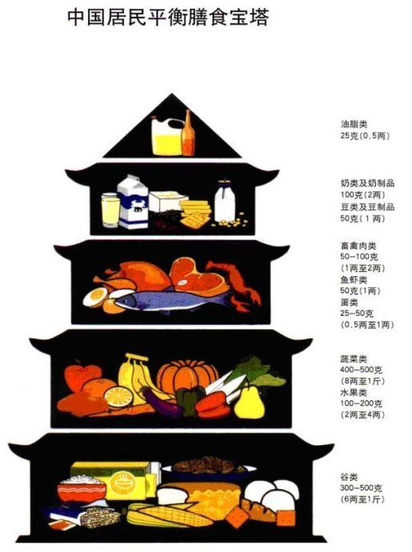

# 营养的种类
## 营养的意义
营养素在人体内的功能主要分为3个方面：
1. 供给能量和维持体温
2. 作为“建筑”材料构成和修补身体组织
3. 作为调节物质，维持机体的正常生命活动，如同机器中的润滑油一样

## 人体所需能量和营养素
### 能量
能量是维持人生命活动必不可少的部分，单位一般为千卡或千焦。1kcal=4.184kJ. 能量的消耗主要由以下4个方面

1. 基础代谢消耗
2. 食物特殊动力作用，摄取营养而引起的能量消耗。蛋白质最强，其次是碳水化合物，最后是脂肪
3. 体力活动的消耗
4. 生长发育消耗的能量
碳水化合物，脂肪,蛋白质作为人体主要的产能营养素，表现不相同。每克脂肪产能量约为9kcal，每克碳水化合物和蛋白质约4kcal。膳食指南推荐三者比例为6.5:2.5:1

### 主要营养素
|名称|作用|主要来源|备注|
|---|:-------------:|:-------------:|---:|
|蛋白质|构成和修补人体组织，构成酶和抗体，供给能量|肝，蛋，瘦肉，豆制品，奶制品；含量中等的是谷类食物|蛋白质的消化率不同，动物性食物可达90%，植物性只有80%。|
|脂类|供给能量，构成一些重要的生理物质，供给必需脂肪酸，维持体温保护脏器，脂溶性维生素来源|烹调油，肥肉，肉类，芝麻松子花生|
|碳水化合物|主要能量来源，构成人体重要物质，增强肝脏解毒能力|谷物，薯类，豆类，坚果类，食糖。蔬菜水果有纤维素和果胶|淀粉是多糖，需分解为双糖（麦芽糖），再分解为可以直接吸收的单糖（葡萄糖）|
|钙|骨骼和牙齿，以离子形式在血液中|奶制品，虾皮，海带，豆制品|吃膳食纤维会不利于吸收|
|铁|血红蛋白，肝脾|动物肝脏，血，鱼肉||
|锌|促进生长发育，增进食欲，增强对于疾病的抵抗力|鲜牡蛎，肉蛋类||
|碘|甲状腺素|海带紫菜海鱼|甲状腺肿大和甲亢|
|维生素A|视网膜细胞，促进蛋白质合成，加强抵抗力|动物肝脏，奶油和蛋黄，红黄绿色蔬菜和水果||
|维生素D|促进钙磷在肠道中吸收|日光，皮肤会产生|
|水|主要生理过程的介质，运输营养素，调节体温，润滑|水，食物水，代谢水|健康成人2500ml
|膳食纤维|促进肠蠕动，防止便秘|玉米，糙米，全麦粉，燕麦，干豆，蔬菜水果|

# 中国居民膳食指南
1. 食物多样，谷物为主
2. 多吃蔬菜，水果和薯类（土豆，白薯，木薯等）
3. 常吃奶类（100g），豆类或其制品（50g）
4. 经常吃适量鱼、禽、蛋、瘦肉，少吃肥肉和荤油
5. 食粮与体力活动要平衡，以保持适宜体重
6. 吃清淡少盐的膳食
7. 如饮酒，应限量
8. 吃清洁卫生不变质的食物

## 膳食宝塔
 

## 食物加工和选择注意
1. 淘米会损失维生素b1，洗的水温要低，次数要少
2. 蒸面食营养损失少，面条营养损失较多
3. 洗菜在流水中冲洗，不可在水中浸泡
4. 红烧清炖肉类时，一些水溶性维生素和糖类，蛋白质融入水中，所以需要连汁带汤吃掉。炸食品严重破坏维生素

# 其他饮食技巧
## 聚餐减脂方法
1. 聚会前2餐少吃
2. 聚餐前几小时可增加一次训练
3. 吃饭前15min喝两杯水
4. 先吃蔬菜这类纤维含量高的
5. 多给朋友加菜
6. 遇油腻拿茶水涮，油的热量高
7. 餐后大步走，后两餐少摄入

## 富有营养的食物
### 提升免疫力的
 - 鸡汤
 - 酸奶
 - 鲑鱼，鲔鱼
 - 大蒜
 - 姜粉
 - 含锌的食物
 - 蔬菜和水果